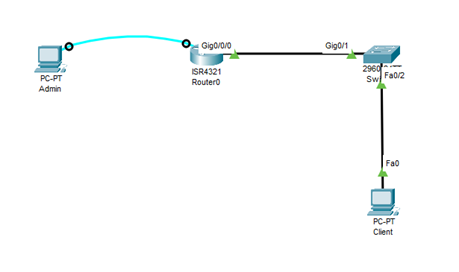

# Netmiko használata - Laborgyakorlat

A Netmiko egy Python könyvtár, amely megkönnyíti a hálózati eszközökhöz való SSH kapcsolatok kezelését. A Netmiko a Paramiko SSH könyvtárra épül, és célja, hogy egyszerűsítse a CLI (Command Line Interface) kapcsolatok kezelését különböző gyártók eszközeivel.

A Netmiko segítségével könnyedén végrehajthatunk parancsokat és konfigurációs változtatásokat hálózati eszközökön.


## I. Teszt




1. lépés: Telepítsd a Python alá a netmiko könyvtárat
```console
pip install netmiko
```
2. lépés:	Kösd össze az Admin PC-t és a Routert konzol kábellel és készítsd el a preconf-ot!
```console
!preconf
hostname R1
enable secret cisco
ip domain-name moriczref.hu
crypto key generate rsa
1024
username admin secret admin
line vty 0 15
login local
transport input ssh

interface FastEthernet0/0
ip address 192.168.1.1 255.255.255.0
no shutdown
```
3. lépés: hozd létre a main.py állományt:
```py
from netmiko import ConnectHandler

# Eszköz adatok
device = {
    'host': '192.168.1.1',
    'username': 'admin',
    'password': 'admin',
    'secret': 'cisco',
    'device_type': 'cisco_ios'
}

# Csatlakozás
net_connect = ConnectHandler(**device)
net_connect.enable()

# ide jönnek a példakódok 1-6-ig
#...

# Végződés
net_connect.send_config_set(['end'])

# Kapcsolat bontása
net_connect.disconnect()
```

### 1. egy parancs küldése
```py
net_connect.send_config_set(["hostname ROUTER2"])
```
### 2. több parancs küldése
```py
net_connect.send_config_set(["hostname ROUTER3", "banner motd #Entry is allowed from 8:00 to 16:00.#"])
```
### 3. egy parancs küldése és az eredmény kiíratása
```py
print(net_connect.send_command("show ip int brief"))
```
### 4. egy parancs küldése és az eredmény elmentése
```py
output = net_connect.send_command("show running-config")
with open('running_config.txt', 'w') as f:
    f.write(output)
```

### 5. egy parancs küldése és az eredmény elmentése
```py
output = net_connect.send_command("show running-config | section interface")
with open('interfaces_config.txt', 'w') as f:
    f.write(output)
```

### 6. parancsok küldése fájlból
Hozd létre a start.txt állományt is
```console
hostname ROUTER_4
interface FastEthernet0/1
ip address 192.168.2.1 255.255.255.0
no shutdown
```


```py
with open('start.txt', 'r') as f:
    config_commands = f.readlines()
net_connect.send_config_set(config_commands)
```
### 7. Csak a GigabitEthernet0/1 kifejezésre illeszkedő sorokat kérjük le
```py
output = net_connect.send_command("show running-config | section GigabitEthernet0/1")
with open('interface_config.txt', 'w') as f:
    f.write(output)
```

ez nem működik
```py
output = net_connect.send_command("show running-config", include="GigabitEthernet0/1")
with open('interface_config.txt', 'w') as f:
    f.write(output)
```
További példák:

VLAN konfiguráció: include="vlan"

IP routing konfiguráció: include="ip route"

NTP konfiguráció: include="ntp"

Többszörös feltétel:

output = net_connect.send_command("show running-config", include=("GigabitEthernet0/1", "vlan 10"))

Példa kivétellel:

output = net_connect.send_command("show running-config", include="vlan", exclude="vlan 10")


5. lépés:	Futtatsd le a py kódot
6. lépés: Ellenőrízd a Routeren, hogy megtörténtek-e a beállítások

## II. Hibakezelés
```py
from netmiko import ConnectHandler, NetmikoAuthenticationException, NetmikoTimeoutException

def get_running_config(device_dict, filename):
    try:
        net_connect = ConnectHandler(**device_dict)
        net_connect.enable()
        
        output = net_connect.send_command("show running-config")

        with open(filename, 'w') as f:
            f.write(output)

        print(f"A konfiguráció sikeresen mentve lett: {filename}")
    except NetmikoAuthenticationException as e:
        print(f"Hiba a hitelesítés során: {e}")
    except NetmikoTimeoutException as e:
        print(f"A kapcsolat időtúllépés miatt megszakadt: {e}")
    except (IOError, OSError) as e:
        print(f"Hiba a fájlba írás során: {e}")
    finally:
        # A kapcsolat bontása, még ha hiba történt is
        net_connect.disconnect()

# Eszköz adatok
device = {
    'host': '192.168.1.1',
    'username': 'admin',
    'password': 'admin',
    'secret': 'cisco',
    'device_type': 'cisco_ios'
}

# Fájl neve
filename = 'running_config.txt'

get_running_config(device, filename)
```

Függvény: A kód egy függvényt definiál, amely a hálózati eszköz adatait és a fájl nevét paraméterként fogadja.

try blokk: Ebben a blokkban helyezkednek el a hálózati műveletek.

except blokkok: A különböző típusú hibákra külön except blokkokat definiálunk.

NetmikoAuthenticationException: Ha a hitelesítés sikertelen.

NetmikoTimeoutException: Ha a kapcsolat időtúllépés miatt megszakad.

IOError és OSError: Ha a fájlba írás során hiba történik.

finally blokk: Ebben a blokkban olyan műveleteket helyezünk el, amelyek mindenképpen végrehajtódnak, függetlenül attól, hogy hiba történt-e vagy sem (például a kapcsolat bontása).


### Retry mechanizmus

A retry mechanizmus célja, hogy a hálózati műveletek során fellépő hibák esetén újrapróbálkozásokat végezzen. Ez különösen hasznos lehet olyan helyzetekben, amikor a hálózati kapcsolat instabil, vagy időnként előfordulhatnak hitelesítési hibák. A mechanizmus a következőképpen működik:

Újrapróbálkozások száma: Meghatározhatod, hogy hány alkalommal próbálkozzon újra a kód, mielőtt végleg feladná. Ezt a max_retries paraméterrel állíthatod be.

Késleltetés: Az újrapróbálkozások között eltelt időt a delay paraméterrel szabályozhatod. Ez lehetőséget ad a hálózatnak, hogy helyreálljon, mielőtt újra próbálkozna.

Hibakezelés: A kód különböző típusú hibákat kezel, mint például hitelesítési hibák (NetmikoAuthenticationException), időtúllépés (NetmikoTimeoutException), és fájlírási hibák (IOError, OSError). Ha hiba történik, a kód naplózza a hibát, vár egy meghatározott időt, majd újrapróbálkozik.

Ez a mechanizmus biztosítja, hogy a kód ne adja fel azonnal, ha egy hiba történik, hanem többször is megpróbálja végrehajtani a műveletet, növelve ezzel a siker esélyét.

```py
from netmiko import ConnectHandler, NetmikoAuthenticationException, NetmikoTimeoutException
import time

def get_running_config(device_dict, filename, max_retries=3, delay=5):
    retries = 0
    while retries < max_retries:
        try:
            net_connect = ConnectHandler(**device_dict)
            output = net_connect.send_command("show running-config")

            with open(filename, 'w') as f:
                f.write(output)

            print(f"A konfiguráció sikeresen mentve lett: {filename}")
            return  # Ha sikeres volt, kilépünk a ciklusból

        except (NetmikoAuthenticationException, NetmikoTimeoutException, IOError, OSError) as e:
            print(f"Hiba történt: {e}. Újrapróbálkozás {retries+1}/{max_retries}...")
            retries += 1
            time.sleep(delay)

    print("A maximális újrapróbálkozás száma elérve.")

# Eszköz adatok
device = {
    'host': '192.168.1.1',
    'username': 'cisco',
    'password': 'cisco',
    'device_type': 'cisco_ios'
}

# Fájl neve
filename = 'running_config.txt'

# Hívjuk a függvényt
get_running_config(device, filename)
```

## III. Naplózás a logging modul használatával

```py
import logging
from netmiko import ConnectHandler, NetmikoAuthenticationException, NetmikoTimeoutException

def get_running_config(device_dict, filename):
    # Konfiguráljuk a logger-t
    logging.basicConfig(filename='netmiko_script.log', level=logging.DEBUG, format='%(asctime)s - %(levelname)s - %(message)s')

    try:
        # Csatlakozás az eszközhöz
        net_connect = ConnectHandler(**device_dict)
        logging.info("Sikeres csatlakozás az eszközhöz")

        # Parancs küldése és az eredmény mentése
        output = net_connect.send_command("show running-config")
        with open(filename, 'w') as f:
            f.write(output)
        logging.info(f"A konfiguráció sikeresen mentve lett: {filename}")

    except NetmikoAuthenticationException as e:
        logging.error(f"Hiba a hitelesítés során: {e}")
    except NetmikoTimeoutException as e:
        logging.error(f"A kapcsolat időtúllépés miatt megszakadt: {e}")
    except (IOError, OSError) as e:
        logging.error(f"Hiba a fájlba írás során: {e}")
    finally:
        try:
            net_connect.disconnect()
            logging.info("Kapcsolat bontva")
        except NameError:
            logging.warning("A kapcsolat nem jött létre, így nem lehetett bontani")

# Eszköz adatok
device = {
    'host': '192.168.1.1',
    'username': 'cisco',
    'password': 'cisco',
    'device_type': 'cisco_ios'
}

# Fájl neve
filename = 'running_config.txt'

# Hívjuk a függvényt
get_running_config(device, filename)

```

logging.basicConfig: Ezzel a függvénnyel konfiguráljuk a logger-t.

filename: A naplófájl neve.

level: A naplózás szintje. DEBUG a leg részletesebb, INFO, WARNING, ERROR és CRITICAL a többi szint.

format: A naplóüzenetek formátuma.

logging.error: A hibaüzeneteket a logging.error függvénnyel írjuk a naplófájlba.


A naplófájl tartalma egy tipikus hiba esetén:

2023-11-22 14:30:00,123 - ERROR - Hiba történt: Authentication failed: [Errno 2] No such file or directory


