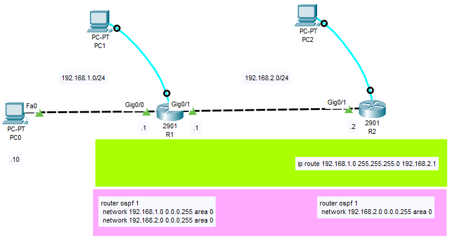
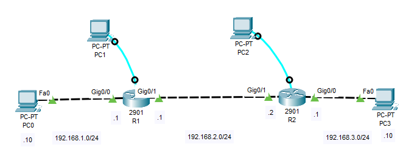
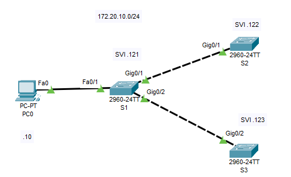

# Netmiko használata II. - Laborgyakorlat

## IV. Csatlakozás több eszközhöz egymás után (sorosan)

(a két routert Switch-en keresztül összekötve ment csak)



```console
!R1 preconf
hostname R1
enable secret cisco
ip domain-name moriczref.hu
crypto key generate rsa
1024
username admin secret admin
line vty 0 15
login local
transport input ssh

interface GigabitEthernet0/0
ip address 192.168.1.1 255.255.255.0
no shutdown

interface GigabitEthernet0/1
ip address 192.168.2.1 255.255.255.0
no shutdown

!R2 preconf
hostname R2
enable secret cisco
ip domain-name moriczref.hu
crypto key generate rsa
1024
username admin secret admin
line vty 0 15
login local
transport input ssh

interface GigabitEthernet0/1
ip address 192.168.2.2 255.255.255.0
no shutdown

ip route 192.168.1.0 255.255.255.0 192.168.2.1

```


```py
from netmiko import ConnectHandler, NetmikoAuthenticationException, NetmikoTimeoutException

def get_running_config(device_dict, filename):
    try:
        net_connect = ConnectHandler(**device_dict)
        net_connect.enable()
        
        output = net_connect.send_command("show running-config")

        with open(filename, 'w') as f:
            f.write(output)

        print(f"A konfiguráció sikeresen mentve lett: {filename}")
    except NetmikoAuthenticationException as e:
        print(f"Hiba a hitelesítés során: {e}")
    except NetmikoTimeoutException as e:
        print(f"A kapcsolat időtúllépés miatt megszakadt: {e}")
    except (IOError, OSError) as e:
        print(f"Hiba a fájlba írás során: {e}")
    finally:
        # A kapcsolat bontása, még ha hiba történt is
        net_connect.disconnect()

# Több eszköz adatai listában
devices = [
    {'host': '192.168.1.1', 'username': 'admin', 'password': 'admin', 'secret': 'cisco', 'device_type': 'cisco_ios'},
    {'host': '192.168.2.2', 'username': 'admin', 'password': 'admin', 'secret': 'cisco', 'device_type': 'cisco_ios'}
    
]

# Csatlakozás minden eszközhöz
for device in devices:
    filename = "running_config_"+device['host']+".txt"    
    get_running_config(device, filename)
```

## V. Dinamikus konfigurációk Jinja2-vel

A template használatához telepíteni kell a jinja2 könyvtárat: 
```pip install jinja2```

Adott az alábbi hálózat. 



```console
!R1 preconf
hostname R1
enable secret cisco
ip domain-name moriczref.hu
crypto key generate rsa 
1024
ip ssh version 2
username admin privilege 15 secret password
line vty 0 15
  login local
  transport input ssh
interface GigabitEthernet0/0
  ip address 192.168.1.1 255.255.255.0
  no shutdown
interface GigabitEthernet0/1
  ip address 192.168.2.1 255.255.255.0
  no shutdown

ip route 192.168.3.0 255.255.255.0 192.168.2.2

!R2 preconf
hostname R2
enable secret cisco
ip domain-name moriczref.hu
crypto key generate rsa
1024
ip ssh version 2
username admin privilege 15 secret password
line vty 0 15
login local
transport input ssh
interface GigbitEthernet0/0
ip address 192.168.3.1 255.255.255.0
no shutdown
interface GigbitEthernet0/1
ip address 192.168.2.2 255.255.255.0
no shutdown

ip route 192.168.1.0 255.255.255.0 192.168.2.1
```
**Teszteljük le:** Pc0-ról tracert 192.168.3.10 (-> A gigabit portokon keresztül megy a forgalom)

Szeretnénk kiegészíteni egy tartalék útvonallal a 10.0.0.0/30-as hálózatba állított Serial0/1/0 portokon keresztül.

```py
from netmiko import ConnectHandler
from jinja2 import Template

# Eszköz adatai
devices = [
    {
        'device_type': 'cisco_ios',
        'host': '192.168.1.1',
        'username': 'admin',
        'password': 'password',
        'secret': 'cisco',
    },
    {
        'device_type': 'cisco_ios',
        'host': '192.168.2.2',
        'username': 'admin',
        'password': 'password',
        'secret': 'cisco',
    }
]

# Konfigurációs sablon
template = Template("""
ip route {{destination_network}} 255.255.255.0 {{next_hop_ip}} 150
interface {{ interface_id }}
  ip address {{ ip_address }} 255.255.255.252
  no shutdown
""")

# Változók
variables_list = [
    {'destination_network': '192.168.3.0', 'next_hop_ip': '10.0.0.2', 'interface_id': 'Serial0/1/0', 'ip_address': '10.0.0.1'},
    {'destination_network': '192.168.1.0', 'next_hop_ip': '10.0.0.1', 'interface_id': 'Serial0/1/0', 'ip_address': '10.0.0.2'} 
]

# Konfiguráció generálása és küldése
for device, variables in zip(devices, variables_list):
    config_commands = template.render(variables)
    connection = ConnectHandler(**device)
    connection.enable()
    output = connection.send_config_set(config_commands.split('\n'))
    print(output)
    connection.disconnect()
```


for device, variables in zip(devices, variables_list):

Egy iterációt hajt végre a devices és variables_list listákon, párosítva az azonos indexű elemeket.
példa: 
```
devices = ['device1', 'device2']
variables_list = ['variables1', 'variables2']
# zip(devices, variables_list) eredménye: [('device1', 'variables1'), ('device2', 'variables2')]
```

**Teszteljük le:** R1 Gi0/1 portjából húzzuk ki a kábelt. Pc0-ról tracert 192.168.3.10 (-> A serial portokon keresztül megy a forgalom)

## VI. VTP jelszó egységes beállítása



[1] Ahhoz, hogy a VTP (VLAN Trunking Protocol) szerver-kliens kommunikáció megfelelően működjön a három switch között, mindhárom switchnek azonos VTP domain névre és VTP jelszóra van szüksége. Ha a domain név vagy a jelszó eltér, a kliens switchek (S2 és S3) nem fogják szinkronizálni a VLAN adatbázist az S1-től (a VTP szerver).

[2] Továbbá az S1 g0/1 és g0/2 interfészei trunk módra vannak állítva az S2 és S3 felé, az S2 és S3 pedig szintén trunk módra vannak konfigurálva az S1 felé. A VLAN 1 (és S1 g0/2-nél minden VLAN) engedélyezve van a trunkon, ami elegendő a VTP működéséhez

```console
!S1 preconf:
hostname S1
enable password cisco
ip domain-name moricz.lan
username admin privilege 15 secret admin 

crypto key generate rsa
1024
ip ssh version 2

interface vlan 1
 ip address 172.20.10.121 255.255.255.0
 no shutdown

vtp mode server
vtp domain moricz.local
vtp password class

line vty 0 15
 login local
 transport input ssh

ip default-gateway 172.20.10.1

!Trönkportok beállítása
interface g0/1
 description S2 felé 
 switchport mode trunk
 switchport trunk allowed vlan 1
 no shutdown

interface g0/2
 description S3 felé 
 switchport mode trunk
 switchport trunk allowed vlan all
 no shutdown


!S2 preconf:
hostname S2
enable password cisco
ip domain-name moricz.lan
username admin privilege 15 secret admin 

crypto key generate rsa
1024
ip ssh version 2

interface vlan 1
 ip address 172.20.10.122 255.255.255.0
 no shutdown

vtp mode client
vtp domain moricz.local
vtp password class

line vty 0 15
 login local
 transport input ssh

ip default-gateway 172.20.10.1

!Trönkportok beállítása
interface g0/1
 description S1 felé 
 switchport mode trunk
 switchport trunk allowed vlan all
 no shutdown

!S3 preconf:
hostname S3
enable password cisco
ip domain-name moricz.lan
username admin privilege 15 secret admin 

crypto key generate rsa
1024
ip ssh version 2

interface vlan 1
 ip address 172.20.10.123 255.255.255.0
 no shutdown

vtp mode client
vtp domain moricz.local
vtp password class

line vty 0 15
 login local
 transport input ssh

ip default-gateway 172.20.10.1

!Trönkportok beállítása
interface g0/2
 description S1 felé 
 switchport mode trunk
 switchport trunk allowed vlan all
 no shutdown

```


Ezen feltételek teljesülése mellett, ha a server-en (S1) - és csak a server-en - létrehozunk egy 10-es vlant, akkor az a klienseken is látszani fog (értsd szinkronizálódik):
S1:
```
vlan 10
 name Teszt
```
```show vlan```

illetve a többi switchen is megnézzük a vlan-okat, akkor ott is látszani fognak.

Ha most átállítjuk az S1-en a vtp jelszót ```cisco```-ra,
S1:
```
vtp password cisco
```
és ugyanitt létrehozunk egy 20-as vlant, majd azt ellenőrízzük a Client switcheken (S2, S3), akkor azt tapasztaljuk, hogy nem szinkronizálódott.

Tehát bár a VTP server automatikusan propagálja a változásokat, a jelszó változás miatt nem tudja most a szinkronizálást ellvégezni. 
Írjunk egy programot, mely minden eszközre ugyanazt a jelszót állítja be:
```
from netmiko import ConnectHandler
vtpass = input("VTP jelszo: ") or "jelszo" 
switchlist = [
	{'hostname':'s1', 'device_type': 'cisco_ios','host': '172.20.10.121','username': 'admin','password': 'cisco'},
	{'hostname':'s2', 'device_type': 'cisco_ios','host': '172.20.10.122','username': 'admin','password': 'cisco'},
	{'hostname':'s3', 'device_type': 'cisco_ios','host': '172.20.10.123','username': 'admin','password': 'cisco'}
]
for switch in switchlist:
  con = ConnectHandler(**switch)
  print(switch["host"]," VTP jelszava:")
  output = con.send_command("show vtp password")
  print(output)
  line = output.split()
  if line[2] != vtpass:
    o1 = con.send_config_set(['vtp password ' + vtpass])
    print(o1)
  con.disconnect()
```

